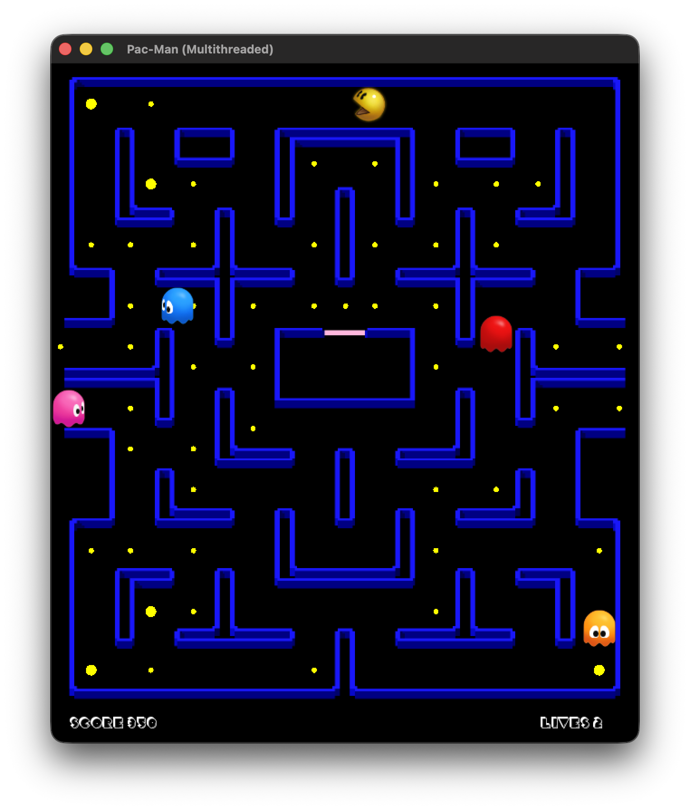
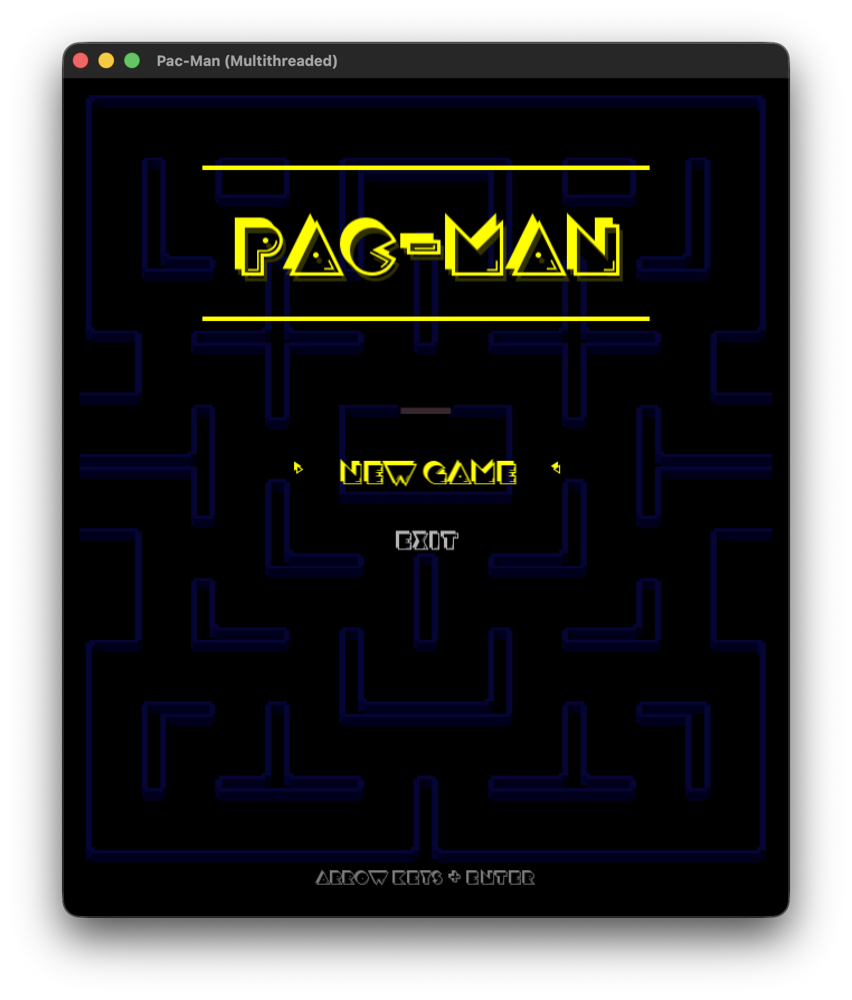
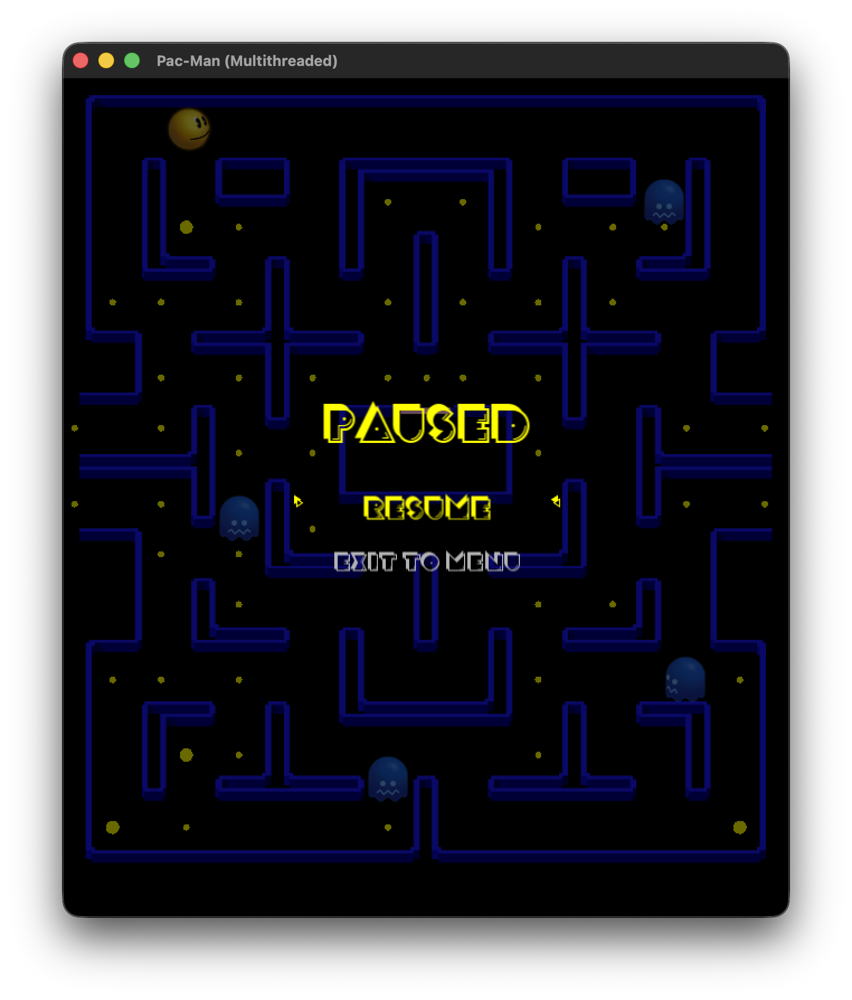

# Pac-Man: Multithreaded Game

A classic Pac-Man clone built with SFML and POSIX threads, demonstrating concurrent programming concepts including mutexes, semaphores, and reader-writer locks.



## Features

- **7 Concurrent Threads**: Main (rendering), Pac-Man, Game Engine, and 4 Ghost threads
- **Graph-based Maze**: 86 nodes with teleportation tunnels
- **Ghost AI**: Individual personalities (Blinky chases, Pinky ambushes, Inky unpredictable, Clyde shy)
- **Power-ups**: Power pellets make ghosts vulnerable and flee
- **Menu System**: Start, pause, game over, and win screens

## Threading Architecture

```
┌─────────────────────────────────────────────────────────────┐
│                      Main Thread                            │
│                   (SFML Rendering)                          │
└─────────────────────────────────────────────────────────────┘
                              │
        ┌─────────────────────┼─────────────────────┐
        ▼                     ▼                     ▼
┌───────────────┐    ┌───────────────┐    ┌───────────────────┐
│  Pac-Man      │    │  Game Engine  │    │  Ghost Threads    │
│  Thread       │    │  Thread       │    │  (4 threads)      │
│               │    │               │    │                   │
│  - Movement   │    │  - Collisions │    │  - AI pathfinding │
│  - Eating     │    │  - Scoring    │    │  - State machine  │
│  - Write lock │    │  - Win/Lose   │    │  - Speed boost    │
└───────────────┘    └───────────────┘    └───────────────────┘
```

## Synchronization Mechanisms

| Mechanism | Purpose | Implementation |
|-----------|---------|----------------|
| **Mutex** | Protect shared game state | `pthread_mutex_t gameMutex` |
| **Reader-Writer Lock** | Board access (ghosts read, Pac-Man writes) | `pthread_rwlock_t boardLock` |
| **Semaphore (Key)** | Ghost house exit key | `sem_t keySem` (init=1) |
| **Semaphore (Permit)** | Ghost house exit permit | `sem_t exitPermitSem` (init=1) |
| **Semaphore (Speed)** | Speed boost resource | `sem_t speedBoost` (init=2) |
| **Semaphore (Pellet)** | Power pellet control | `sem_t powerPelletSem` (init=4) |
| **Atomic Flags** | Thread coordination | `std::atomic<bool>` |

### Deadlock Prevention

Ghost house exit uses **lock ordering**:
```cpp
sem_wait(keySem);        // Always acquire key first
sem_wait(exitPermitSem); // Then acquire permit
// ... leave house ...
sem_post(exitPermitSem);
sem_post(keySem);
```

### Priority-based Resource Access

Faster ghosts (Blinky, Pinky) have higher chance of acquiring speed boost:
- Fast ghosts: 1/100 chance per frame
- Slow ghosts: 1/300 chance per frame

## Screenshots

| Main Menu | Gameplay | Pause Screen |
|-----------|----------|--------------|
|  |  |  |

## Building

### Prerequisites

- C++17 compiler
- CMake 3.16+
- SFML 3.0

### macOS

```bash
# Install dependencies
brew install sfml cmake

# Build
mkdir build && cd build
cmake ..
make

# Run
./PacMan
```

## Controls

| Key | Action |
|-----|--------|
| Arrow Keys | Move Pac-Man |
| Enter | Select menu item |
| Escape | Pause game |
| D | Toggle debug view |

## Project Structure

```
src/
├── main.cpp         # Thread creation, game loop
├── Maze.h           # Graph-based maze (86 nodes)
├── Pacman.h         # Pac-Man entity and movement
├── Ghost.h          # Ghost AI with state machine
├── ThreadManager.h  # Mutexes, semaphores, thread data
├── Menu.h           # UI and game state management
└── Constants.h      # Configuration values
```

## OS Concepts Demonstrated

1. **Thread Creation**: `pthread_create` for 6 worker threads
2. **Mutual Exclusion**: `pthread_mutex_t` for critical sections
3. **Reader-Writer Problem**: `pthread_rwlock_t` for concurrent reads
4. **Semaphores**: Named semaphores for resource control
5. **Deadlock Prevention**: Consistent lock ordering
6. **Priority Scheduling**: Priority-based resource acquisition
7. **Atomic Operations**: Lock-free thread coordination flags

## Credits

- **Game Assets**: Sprites sourced from [The Spriters Resource](https://www.spriters-resource.com/)
- **License**: Project code released under [MIT License](LICENSE)
